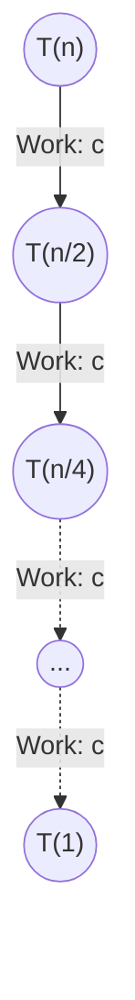

when it comes to analyzing the time complexity of recursive functions, we use three main methods:
1. Substitution method
2. Recursion tree method
3. Master theorem

before diving into the methods, we first need to derive the recurrence relation of the function.   
A recurrence relation is an equation that defines a sequence of values based on previous values. For example, if we have a recursive function that calls itself twice, we can express its time complexity as $T(n) = 2\cdot T(\frac{n}{2}) + O(1)$, where $T(n)$ is the time complexity of the function for input size $n$.

## How to derive the recurrence relation?

Let's analyze the following recursive function:

```cpp showLineNumbers
int binarySearch(int arr[], int left, int right, int target) {
    if (right >= left) {
        int mid = left + (right - left) / 2;
        if (arr[mid] == target)
            return mid;
        if (arr[mid] > target)
            return binarySearch(arr, left, mid - 1, target); // recursive call for the left half
        return binarySearch(arr, mid + 1, right, target); // recursive call for the right half
    }
    return -1;
}
```

Notice that the function call itself on line numbers `7` and `8`. That's the recursive call. Each time we call `binarySearch`, it internally calls itself with a smaller portion of the array, which creates a new stack frame for each call. 
Even though we cannot see any loops or iterative constructs in the code, we cannot say its $O(1)$ 

### Analyzing the time complexity

Lets investigate one line at a time.
- **Line 1**: `int binarySearch(int arr[], int left, int right, int target)`  
     Let's assume the input size is `n`, which is the number of elements in the array. and The time this function would take to run is denoted as $T(n)$.

- **Line 2**: `if (right >= left)`  
    Constant time. Notice if the condition is `false`, The $T(n)$ would be $C_1$ because it will return -1 immediately.  
    We can assume when the left and right pointers are equal, the function will take constant time to execute. So we can say that $T(1) = C_1$.

- **Line 3,4,5,6**: 
    ```cpp 
    int mid = left + (right - left) / 2;
    if (arr[mid] == target)
        return mid;
    if (arr[mid] > target)
    ```
        These lines also take constant time, $C_i$, because they perform a fixed number of operations regardless of the input size.

- **Line 7**: `return binarySearch(arr, left, mid - 1, target);`  
 This is where it gets interesting. This includes a recursive call. So we will assume this would take the same time as $T(n)$ when the input size is $n$.  
 But notice the input size for this call is $\frac{n}{2}$, as it operates on the left half of the array. Therefore, the time complexity for this call can be expressed as $T(\frac{n}{2})$.

- **Line 8**: `return binarySearch(arr, mid + 1, right, target);`  
    Similar to line 7, this also includes a recursive call. The input size for this call is also $\frac{n}{2}$, as it operates on the right half of the array. Therefore, the time complexity for this call can also be expressed as $T(\frac{n}{2})$.

Now let's see the total time complexity with the code, $C_i$ represent constant times:

```cpp showLineNumbers
int binarySearch(int arr[], int left, int right, int target) {
    if (right >= left) {
        int mid = left + (right - left) / 2; // C1
        if (arr[mid] == target) // C2
            return mid; // C3
        if (arr[mid] > target) // C4
            return binarySearch(arr, left, mid - 1, target); // T(n/2)
        return binarySearch(arr, mid + 1, right, target); //  T(n/2)
    }
    return -1; // C5
}
```

Now let's analyze cases of the function:

- $n=1$:  
    $$
        T(1) = C1 + C2 + C3 + C4 + C5 
        \\ T(1) = C_1
    $$

- $n>1$:  
    $$
        T(n) = C1 + C2 + C3 + C4 + T(\frac{n}{2})    
        \\ T(n) = T(\frac{n}{2}) + C
    $$  

    
We have officially derived the recurrence relation formula.  
Notice even though we have **two** recursive calls in the code, only one of them will be executed at a time. So we can say that the time complexity of the function is $T(n) = T(\frac{n}{2}) + O(1)$.

---

## Analyze time complexiting using methods

### Substitution method
There are two ways to solve the recurrence relation using the substitution method:
1. **Guess and check**: We make an educated guess about the form of the solution and then use mathematical induction to verify our guess.
2. **Iterative substitution**: We repeatedly substitute the recurrence relation into itself until we can identify a pattern or reach a base case.

#### Guess and check method

We assume our function $T(n)$ as an upper bound $O(g(n))$.

- Hypothesis: $T(n) \le c \cdot g(n)$ for all $n \ge n_0$, where $c$ is a positive constant.

We prove this using mathematical induction.

$T(n) = T(\frac{n}{2}) + O(1)$  
$g(n) = \log_2 n$  

Hypothesis for the current case: $T(n) \le c \cdot \log_2 n$  for all $n \ge n_0$.

1. Base case: (usually $n=1$)  
    $$
    \begin{align}
        T(1) &= C_1 \notag  
        \\ g(1) &= \log_2 1 = 0 \notag  
        \\ T(1) &\le c \cdot g(1) \notag  
        \\ T(1) &\le c \cdot 0 \notag  

    \end{align}
    $$
    Notice that is a pitfall!. The base case says $T(1) = 1$, but our proof says $T(1) \le 0$. This is a common trap. This does not mean our hypothesis is wrong. Notice our hypothesis says it needs to be true for all $n \ge n_0$.  
    So we can choose a different base case, for example  $n_0=2$.  
    $$
    \begin{align}
        T(2) &= T(1) + O(1)   \notag
        \\ T(2) &= C_1 + O(1) = C_2 \notag
        \\ g(2) &= \log_2 2 = 1 \notag
        \\ T(2) &\le c \cdot g(2) \notag
        \\ C_2 &\le c \cdot 1 \notag
        \\ C_2 &\le c \notag

    \end{align}
    $$
    Now we have a valid base case.

2. Inductive step: Assume the hypothesis holds for all $k < n$, we need to show it holds for $n$.

$$
\begin{align}
 
    T(n) &= T\left(\frac{n}{2}\right) + C_k \notag 
    \\ g\left(\frac{n}{2}\right) &= \log_2 \frac{n}{2} \notag
    \\ T(n) &\le c \cdot g\left(\frac{n}{2}\right) + C_k && \text{(since $\frac{n}{2} < n$, by hypothesis)} \notag
    \\ T(n) &\le c \cdot \log_2 \frac{n}{2} + C_k \notag
    \\ T(n) &\le c \cdot (\log_2 n - \log_2 2) + C_k \notag
    \\ T(n) &\le c \cdot \log_2 n - c + C_k \notag
    \\ T(n) &\le c \cdot \log_2 n + (C_k - c) \notag 
    \\ T(n) &\le c \cdot \log_2 n && \text{ (choose $c$ such that $C_k - c \le 0$)}  \notag   
 

\end{align}
$$

Now that we have shown that the hypothesis holds for $n$, we can conclude that $T(n) = O(\log_2 n)$.
That wraps up the guess and check method. We have successfully analyzed the time complexity of the recursive function using the substitution method.

#### Iterative substitution method

We iteratively substitute the recurrence relation to find a pattern or until hit the base case.

$$
\begin{align}
T(n) = T\left(\frac{n}{2}\right) + C_k  
\\ T\left(\frac{n}{2}\right) = T\left(\frac{n}{4}\right) + C_k 
\end{align}  
$$
Substituting equation $(2)$ into the original equation, we get:
$$
\begin{align}
T(n) &= T\left(\frac{n}{2^2}\right) + C_k + C_k \notag
\\ T(n) &= T\left(\frac{n}{2^3}\right) + C_k + C_k + C_k  \notag  
\\ T(n) &= T\left(\frac{n}{2^4}\right) + C_k + C_k + C_k + C_k \notag
\\ &\vdots \notag
\\ T(n) &= T\left(\frac{n}{2^i}\right) + i \cdot C_k \notag
\end{align}  
$$

where $i$ is the number of times we have substituted the recurrence relation.

Now we need to find the value of $i$ when we hit the base case. The base case is when $n=1$, so we set $\frac{n}{2^i} = 1$ and solve for $i$:
$$ 
\begin{align}
\frac{n}{2^i} &= 1 \notag
\\ n &= 2^i \notag
\\ i &= \log_2 n \notag
\end{align}
$$

We also know $$T(1) = C_1$$.
Now lets consider $ i =\log_2 n $, iteration.  
$$
\begin{align}
T(n) &= T\left(\frac{n}{2^{\log_2 n }}\right) + \log_2 n  \cdot C_k \notag
\\ T(n) &= T(1) + \log_2 n  \cdot C_k \notag
\\ T(n) &= C_1 + \log_2 n  \cdot C_k \notag
\\ T(n) &= O(\log_2 n) \notag
\end{align}
$$

Now we analyzed the time complexity using the iterative approach. But notice the subtle naunce that we let  $ i =\log_2 n $ which is not an integer. In practice, we would take the $\lfloor \log_2 n \rfloor$ to ensure that $i$ is an integer. However, since we are interested in the asymptotic behavior of the function, this does not affect our analysis, and we can still conclude that $T(n) = O(\log_2 n)$.
 

## Recursion tree method

A recursion tree is a visual representation of all the recursive calls made. Each node represents the cost of a single subproblem, and we sum the costs of all nodes to get the total time complexity.

For our recurrence relation $T(n) = T(\frac{n}{2}) + O(1)$, let's denote the constant time $O(1)$ as $c$. Since the function is called only once per execution with half the input size, the "tree" doesn't branch out—it forms a single straight path.



Let's break down the total cost:
1. **Depth of the tree**: The input size halves at each step ($n \to \frac{n}{2} \to \frac{n}{4} \dots \to 1$). We reach the base case when $\frac{n}{2^k} = 1$, which gives a depth of $k = \log_2 n$.
2. **Cost per level**: Because there are no branching recursive calls, there is only $1$ node at each level. The work done at each node is a constant $c$.
3. **Total Work**: We multiply the number of levels by the cost per level:
   $$ \text{Total Work} = \sum_{i=0}^{\log_2 n} c = c \cdot \log_2 n $$

Therefore, the total time complexity is **$O(\log_2 n)$**.

